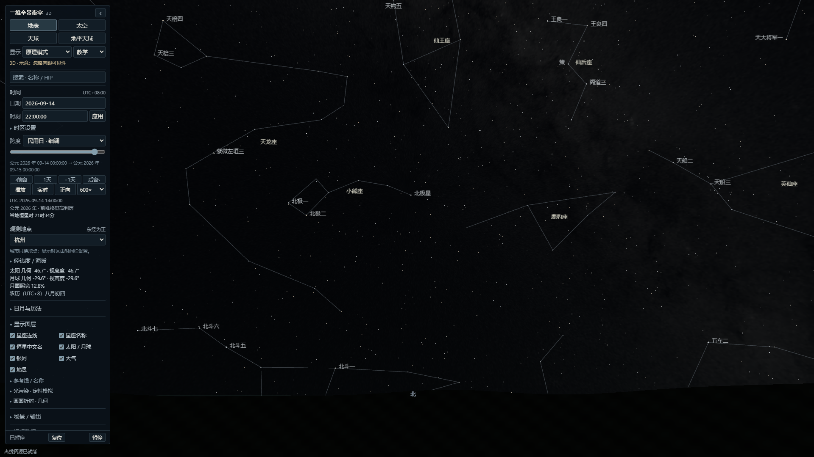

# Sky Simulator · 三维全景夜空

在地表、地球与天球之间切换，探索星空、日月运动和观测地点的关系。面向课堂演示、天文入门和自主学习，提供中文界面及可直接打开的离线单文件。

**v0.1.0 是公开预览版。** 已完成本机 Windows 范围内的功能与科学参考检查；尚不承诺跨设备稳定性或全时空精度。Firefox 有一次未复现的交互超时，详见下方限制。

[下载 v0.1.0 预览版](https://github.com/Ray8mu34/Sky-Simulator/releases/tag/v0.1.0) · [项目介绍 PDF](media/Sky-Simulator-Overview.pdf) · [发布说明](docs/RELEASE-NOTES-v0.1.0.md) · [科学模型](docs/SCIENCE-MODEL.md)



## 四种视图

|视图|可以观察什么|
|---|---|
|地表|从所选经纬度观察天空、地平与星体升落；对比几何方向和标准折射近似。|
|太空|环绕地球观察昼夜、地轴与背景星空；日景、夜灯、云层可独立开关。|
|天球|在有限天球上观察恒星、星座、天赤道、黄道与地球的关系。|
|地平天球|比较当地地平、天顶、天极与天球方向，演示纬度变化的影响。|

四视图共用时间、地点和对象选择，各自保留相机；外部视图支持惯性、随地球和地平参考锁定。拖动或单指调整视线，滚轮或双指缩放。

## 主要功能

- **星空与搜索**：8,921 颗 HYG 恒星、88 星座连线及中文名称；按中文、英文、HIP/HYG 编号搜索，选择、高亮和定位对象。
- **日月教学**：月相放大镜、相邻四月相时刻、太阳/月球/所选恒星的当地日升落事件，以及三种晨昏与极昼极夜说明。
- **时间与历法**：播放、倒播、日期步进与民用时间滑条；固定 UTC 偏移或 IANA 时区；固定 UTC+8 的农历日期。
- **观察与示意**：银河背景、日光、月光及人工天空亮度的定性对比；地表可切换几何方向与按气压、温度设置的折射近似。
- **场景与输出**：21 个教学预设、命名本地场景、JSON 导入导出、截图；Web 版可生成包含场景状态的分享链接。
- **离线与回退**：便携 HTML 内含运行资源；Web 版具备离线缓存和等待更新机制。WebGL2 不可用或上下文丢失时，切换到真实 Canvas2D 全天方位图，保留科学读数和场景状态。

可以从“北极星 / Polaris / HIP11767”开始，切换四视图观察方向；再试“猎户座 / Ori”的星座高亮，或 G01–G03 预设中的暗夜、郊外、城市银河对比。

## 下载与运行

无需开发环境时，前往 [GitHub Releases](https://github.com/Ray8mu34/Sky-Simulator/releases) 下载便携 HTML，用桌面浏览器直接打开。运行资源已内嵌，首次打开也不需要联网。Chrome、Edge 是当前主要验证浏览器；Firefox 的最终兼容性仍待确认。

Web 发行包适合静态服务器部署。**不要用 `file:` 打开 Web 包里的 `index.html` 来替代便携版。** PWA 安装与离线缓存需要 HTTPS 或 localhost 安全上下文，且受浏览器支持与缓存策略影响。

新版完整缓存后，应用会提示先保存场景、关闭本应用所有页面，再重新打开；不会在教学中强制替换当前版本。便携版分享请使用场景 JSON，不是本机文件路径。

## 从源码开发

需要 Node.js 24 与 pnpm 11；当前固定工具版本为 Node.js 24.14.0、pnpm 11.0.9。依赖由 `pnpm-lock.yaml` 锁定。仓库已包含运行素材，普通构建无需下载上游原始资产或安装 Python。

```powershell
pnpm install --frozen-lockfile
pnpm dev
```

开发地址：<http://127.0.0.1:5173/>。

```powershell
pnpm build
pnpm build:portable
pnpm exec vite preview --host 127.0.0.1 --port 4173 --strictPort
```

`dist/` 是 Web 包；`dist-portable/三维全景夜空.html` 是便携文件。`pnpm build` 包含类型检查。最小 GitHub Actions CI 仅执行固定依赖安装、类型检查与 Web 构建，不代替真实浏览器或设备验收。

发布文件、校验清单与静态部署注意事项见 [发布指南](docs/PUBLISHING.md)，已有检查范围见 [验证摘要](docs/VALIDATION.md)。永久科学夹具保留在 `tests/fixtures/` 与 `qa/`；完整资产溯源审计需要单独恢复上游原件，详见 [夹具说明](qa/README.md)。

## 已知限制

- 这是教学与探索工具。输入范围为天文纪年 −2000 至 +4000，扩展年代仅作近似探索；已检查的参考样本不等同整个时空范围的精度认证。
- 折射是经验大气近似；升落事件使用独立标准口径，不随画面气压、温度改变。光污染不是实测 SQM、Bortle 等级或天气预报；地球、月面与银河图像为静态素材。
- IANA 民用时间支持 1900–2100；农历表支持公历 1901–2100、固定 UTC+8，2057/2089/2097 有明确预测不确定标记。
- 二维回退是全天方位图；日月符号不表示真实角径或月面，不提供全部三维图层及月相放大镜。
- 最终 Firefox 单文件检查有一次 P0/80 折射提交点击超时并出现黑色主画布；一次保留原生操作的诊断未复现，根因未知，不能据此称兼容问题已解决。
- macOS Safari、实体 iOS/Android 设备、真实发行域的系统 PWA 安装与软键盘尚未完成验证。已做的移动尺寸/触摸模拟不等同实体设备验收；30 分钟连续测试暂缓。
- 短测中的 CPU 回调时间、RAF 间隔和资源估算不等同 GPU 完成时间、实际显存或物理屏幕帧率。

## 许可与署名

本项目自有代码采用 [MIT License](LICENSE)，Copyright © 2026 Ray8mu34。**第三方数据、图像与依赖保留原许可；MIT 不覆盖所有素材。**

|来源|用途与许可说明|
|---|---|
|David Nash / Astronexus HYG 4.1|恒星数据，CC BY-SA 4.0。|
|Stellarium v24.4 及其贡献者|星座连线、名称与中文星名，CC BY-SA 4.0。|
|NASA/GSFC、NASA Earth Observatory|地球、月面与银河图像，保留 NASA 素材条件和各作品署名。|
|ESA/Gaia/DPAC 及相关贡献者|银河素材的观测数据来源，保留完整资料署名。|
|6tail / lunar-typescript|离线农历表生成来源，保留 MIT 许可；不是浏览器运行依赖。|
|Astronomy Engine / Three.js|天文计算与图形库，分别保留上游 MIT 许可。|

完整来源、加工记录与输出哈希见 [资产清单](assets/assets-manifest.json)；许可证及详细署名见 [assets/licenses](assets/licenses/)。Web 包随附 `credits/`，便携 HTML 内嵌相同署名资料。项目及演示图片不表示 NASA、ESA 或其他数据提供者为本应用背书。

## English summary

Sky Simulator is a Chinese-language astronomy teaching preview with four synchronized views, star search, Moon-phase teaching, local rise/set events, qualitative sky brightness, and a real Canvas2D fallback. Download the self-contained offline HTML from [Releases](https://github.com/Ray8mu34/Sky-Simulator/releases/tag/v0.1.0), or build the static Web version with Node.js 24 and pnpm 11.

Version 0.1.0 is a public preview, not a claim of cross-device stability or full-domain scientific accuracy. Windows Chrome/Edge are the main verified targets; Firefox has an unresolved intermittent submission/black-canvas observation. Physical mobile devices and macOS Safari remain unverified. Original code is MIT; third-party assets retain their separate licenses and attribution.
